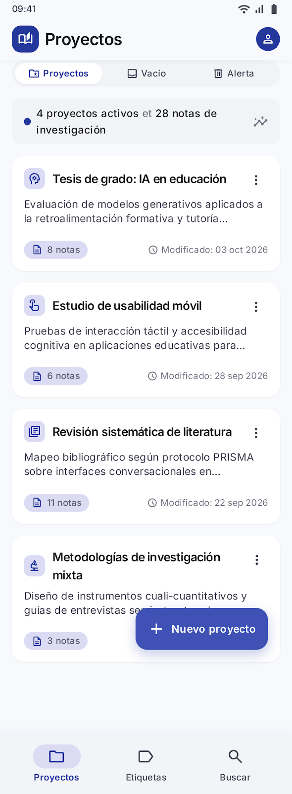
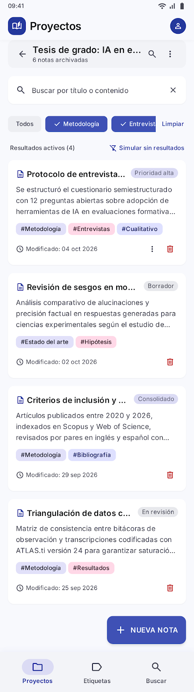
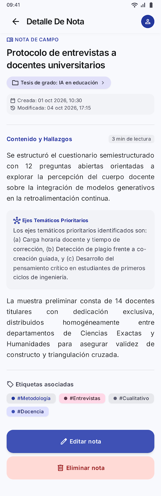
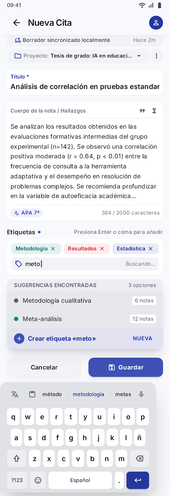
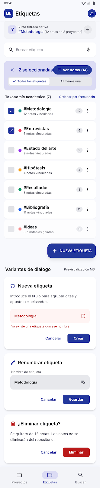
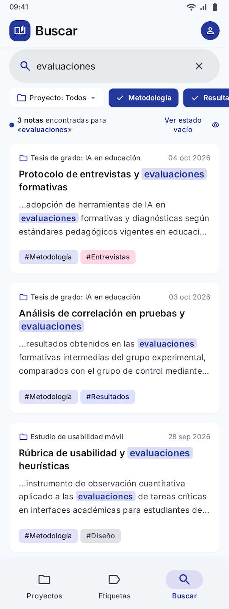
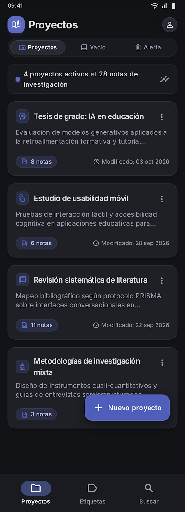
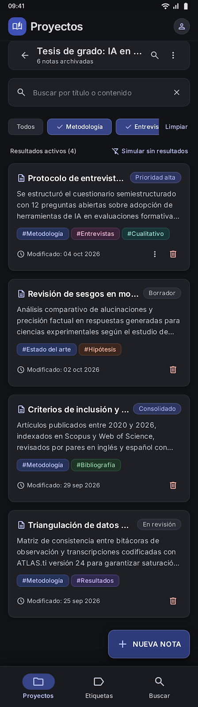
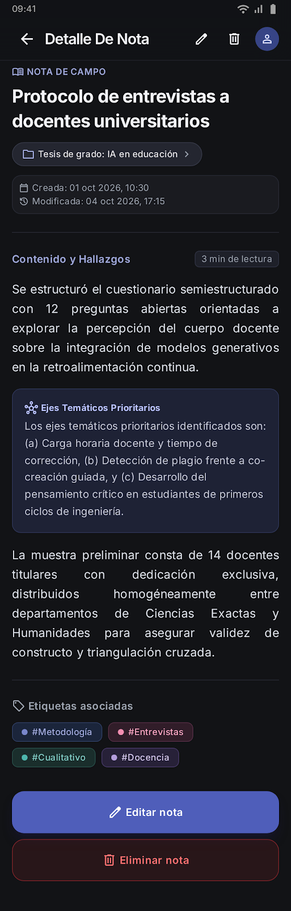
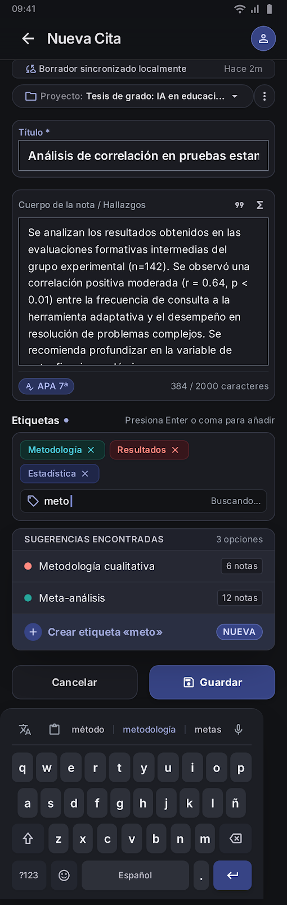

# ReNotes

Aplicación Android de notas académicas con proyectos, búsqueda global y
etiquetas. Todo el estado vive en memoria durante la sesión: no hay servidor,
autenticación ni base de datos.

<p align="center">
  
</p>

## Diseño

Los.mockups son de Stitch y se corresponden una a uno con las pantallas
implementadas. Los archivos viven en [`docs/images/`](docs/images).

### Tema claro · Academic Indigo

| Proyectos | Notas del proyecto | Detalle de nota |
| --- | --- | --- |
|  |  |  |

| Editor de nota | Etiquetas | Buscar |
| --- | --- | --- |
|  |  |  |

### Tema oscuro · ReNotes Dark Academia

| Proyectos | Notas del proyecto | Detalle de nota | Editor de nota |
| --- | --- | --- | --- |
|  |  |  |  |

Los.mockups de etiquetas y búsqueda se muestran sólo en tema claro porque el
resto de la app comparte componentes con las pantallas anteriores.

## Requisitos

- Flutter 3.44.9 (Dart 3.12.2)
- SDK de Android (`ANDROID_HOME` apuntando a tu SDK)

## Puesta en marcha

```bash
flutter pub get
flutter run
```

Pruebas y análisis:

```bash
flutter analyze
flutter test
```

APK de depuración:

```bash
flutter build apk --debug
```

## Arquitectura

```
lib/
├── main.dart                  App + inyección del store
├── data/
│   ├── app_store.dart         ChangeNotifier: CRUD, búsqueda y filtros
│   └── datos_iniciales.dart   3 proyectos, 15 notas y 9 etiquetas
├── models/modelos.dart        Proyecto, Nota, Etiqueta, FiltroEtiquetas
├── screens/                   Una pantalla por requisito (RF1…RF6)
├── theme/app_theme.dart       Temas claro y oscuro + paleta de etiquetas
├── utils/                     Normalización de texto y fechas
└── widgets/                   AppScope y widgets compartidos
```

`AppStore` es la única fuente de verdad. Se expone con `AppScope`, un
`InheritedNotifier` que reconstruye a quien dependa de él, así que cualquier
pantalla refleja al instante un alta, una edición o un borrado hecho en otra.
No se usa ningún paquete externo de gestión de estado.

`HomeShell` mantiene las tres pestañas dentro de un `IndexedStack` para que cada
una conserve su posición de scroll, su texto de búsqueda y sus filtros al
alternar entre ellas.

## Pantallas

| Requisito | Pantalla | Qué resuelve |
| --- | --- | --- |
| RF1 | `proyectos_screen.dart` | Lista de proyectos, búsqueda, alta, edición y borrado en cascada |
| RF2 | `notas_proyecto_screen.dart` | Notas del proyecto con extractos y filtros por etiqueta |
| RF3 | `editor_nota_screen.dart` | Editor con validación, autocompletado de etiquetas y aviso de cambios sin guardar |
| RF4 | `detalle_nota_screen.dart` | Metadatos, cuerpo largo, etiquetas navegables y notas relacionadas |
| RF5 | `etiquetas_screen.dart` | CRUD de etiquetas y agrupación de notas de todos los proyectos |
| RF6 | `buscar_screen.dart` | Búsqueda global por título o contenido con filtros |

## Detalles de comportamiento

**Búsqueda y etiquetas sin acentos ni mayúsculas.** `normalizar()` pliega el
Suplemento Latino-1, de modo que `Estadística`, `estadistica` y
`  ESTADISTICA ` son la misma clave. Afecta tanto a la búsqueda como a la
unicidad de nombres al crear o renombrar.

**Autocompletado de etiquetas.** Se construye con `RawAutocomplete` sobre el
catálogo completo, no sólo sobre las del proyecto. Intro o coma fijan la
sugerencia; si el texto no existe, se crea la etiqueta al guardarla.

**Cambios sin guardar.** `PopScope` compara título, cuerpo y etiquetas contra el
estado con el que se abrió la pantalla. Los controladores llaman a `setState`
en cada pulsación para que `canPop` se reevalúe: escribir y salir con el botón
atrás siempre pide confirmación.

**Eliminación en cascada.** Borrar un proyecto borra también sus notas, y
borrar una etiqueta la quita de todas las notas sin borrar ninguna. Los
diálogos dicen cuántos elementos se van a ver afectados.

**Etiquetas en el detalle.** Pulsar una etiqueta en una nota abre la pantalla de
etiquetas con esa selección ya activa, para que se vean las notas de todos los
proyectos que la comparten.

## Tema

El conmutador de la barra superior alterna entre el tema claro *Academic Indigo*
y el oscuro *ReNotes Dark Academia*. El color de cada etiqueta se deriva de su
id con `TagPalette.of`, así que se mantiene entre temas y pantallas. Las fuentes
Inter, Newsreader y JetBrains Mono van empaquetadas en `assets/fonts/`.

### Paletas de colores

Definidas en `lib/theme/app_theme.dart`. Los códigos coinciden con los
`DESIGN.md` de cada tema.

**Academic Indigo (claro)**

| Rol | Hex | Rol | Hex |
| --- | --- | --- | --- |
| Primary | `#3F51B5` | Primary container | `#E8EAF6` |
| Primary pulsado | `#303F9F` | On primary container | `#1A237E` |
| Superficie | `#F7F8FC` | Tarjeta | `#FFFFFF` |
| Campo / barra | `#EEF0F8` | Divisor | `#E0E2EC` |
| On surface | `#191C20` | On surface variant | `#44474E` |
| Texto sutil | `#74777F` | Error | `#BA1A1A` |

**ReNotes Dark Academia (oscuro)**

| Rol | Hex | Rol | Hex |
| --- | --- | --- | --- |
| Lienzo | `#121316` | Superficie baja | `#1A1B20` |
| Panel | `#202228` | Tarjeta | `#1F1F23` |
| Campo | `#16171C` | Línea | `#2C2E38` |
| On surface | `#E2E2E6` | On surface variant | `#C4C6D0` |
| Texto sutil | `#8E9099` | Primary | `#9FA8DA` |
| Secondary | `#7986CB` | Error | `#FFB4AB` |

**Paleta de etiquetas** (8 pares, mismo orden en ambos temas)

| # | Color | Contenedor claro | Tinta clara | Contenedor oscuro | Tinta oscura |
| --- | --- | --- | --- | --- | --- |
| 1 | Teal | `#E0F2F1` | `#00695C` | `#122826` | `#80CBC4` |
| 2 | Amber | `#FFF8E1` | `#F57F17` | `#2C2413` | `#FFE082` |
| 3 | Coral | `#FFEBEE` | `#C62828` | `#2F1918` | `#FFAB91` |
| 4 | Violet | `#F3E5F5` | `#6A1B9A` | `#24182E` | `#CE93D8` |
| 5 | Green | `#E8F5E9` | `#2E7D32` | `#16281B` | `#A5D6A7` |
| 6 | Blue | `#E3F2FD` | `#1565C0` | `#132236` | `#90CAF9` |
| 7 | Pink | `#FCE4EC` | `#AD1457` | `#2E1422` | `#F48FB1` |
| 8 | Orange | `#FFF3E0` | `#E65100` | `#2D1C13` | `#FFCC80` |

El índice sale de un hash del id de la etiqueta (`TagPalette.of`), no de su
posición en la lista, así que una etiqueta conserva su color aunque el catálogo
se reordene.